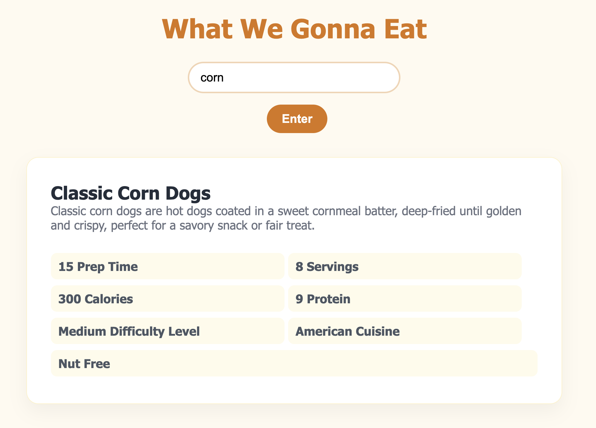

# 🍽️ Recipe Finder

A recipe discovery application that allows users to search for recipes based on an ingredient they already have or want to cook with.

---

## ✨ About the Project

The **Recipe Finder** is designed to make discovering new meals simple.

Instead of searching for a specific recipe, the user can enter **any ingredient** they want to cook with. The application uses that ingredient to retrieve a recipe and provides detailed information about the dish.

Users can continue searching with the same ingredient to explore different recipe options, making it easy to discover new meals and cuisines.

---

## 🔎 How It Works

1. The user enters an **ingredient** they would like to cook with.
2. The application sends the ingredient to the recipe API.
3. The API retrieves a recipe containing that ingredient.
4. JavaScript accesses the returned recipe data.
5. The recipe information is dynamically displayed on the page.
6. The user can continue clicking to discover additional recipes using that ingredient.

Each recipe can provide information including:

- 🍴 Name of the dish
- 📝 Description
- ⏱️ Preparation time
- 🍽️ Serving size
- 🔥 Calories
- 💪 Protein
- ⭐ Difficulty level
- 🌎 Type of cuisine
- 🥗 Dietary information

---

## 🛠️ Built With

- HTML
- CSS
- JavaScript
- Recipe API
- Fetch API
- REST API
- DOM Manipulation

---

## 📸 Project Preview



---

## 💡 What I Practiced

This project gave me more experience working with API data and dynamically displaying detailed information returned from an API.

Some of the skills I practiced include:

- Making API requests with `fetch()`
- Working with JSON data
- Using user input in an API request
- Accessing nested API data
- Dynamically displaying API results in the DOM
- Working with recipe and nutrition data
- Displaying multiple pieces of information from one API response
- Allowing users to continue searching for different results
- Building an application around a real-world restaurant and food use case

---

## 🚀 Run the Project

1. Clone the repository:

```bash
git clone https://github.com/smayanja3/simple-api-restaurant.git
```

2. Open the project folder.
3. Open `index.html` in your browser.
4. Enter an ingredient to start discovering recipes! 🍽️👩🏽‍🍳

Keep searching to explore different dishes using your selected ingredient.

Thanks for checking out my project! 🍴✨
